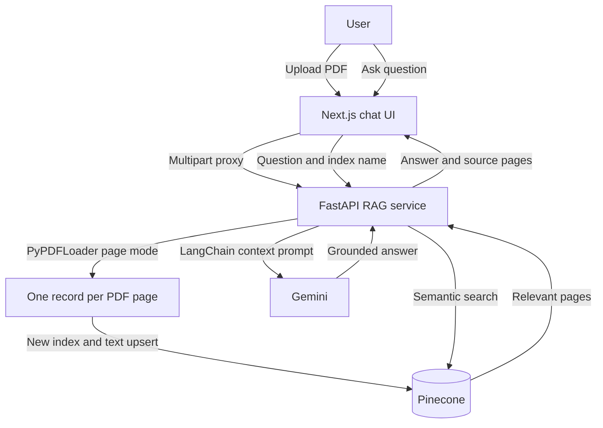

# Gemini Chat App with Pinecone PDF RAG

A full-stack assistant with general Gemini chat and PDF Q&A using FastAPI, LangChain, page-based chunking, and Pinecone.

The Week 5 implementation creates a **new Pinecone index for every uploaded PDF**. Each non-empty PDF page becomes one vector record, keeping its filename and page number as metadata for citations.

## Architecture



## RAG design

| Requirement | Implementation |
| --- | --- |
| Pinecone vector store | Serverless Pinecone index with integrated `llama-text-embed-v2` embeddings |
| New index per file | Unique filename-based index name with a random suffix |
| Chunking by page | LangChain `PyPDFLoader(mode="page")`; one non-empty page per record |
| LangChain | PDF loading, prompt construction, and Gemini model orchestration |
| FastAPI | `/documents`, `/query`, and `/health` endpoints |
| Chat integration | **PDF Q&A** dialog in the existing Next.js assistant |
| Citations | Filename and one-based PDF page number stored and returned as metadata |

## Apple 2025 Form 10-K answers

Upload `rag-api/sample_docs/apple-10-k-2025.pdf`, then ask the homework questions.

### 1. Apple revenue by products and services

Fiscal 2025 net sales (dollars in millions):

| Category | Net sales |
| --- | ---: |
| iPhone | $209,586 million |
| Mac | $33,708 million |
| iPad | $28,023 million |
| Wearables, Home and Accessories | $35,686 million |
| Services | $109,158 million |
| **Total** | **$416,161 million** |

Source: PDF page 26 (printed Form 10-K page 23).

### 2. Apple headquarters

**One Apple Park Way, Cupertino, California 95014.**

Sources: PDF pages 1 and 20. See [`rag-api/EXPECTED_ANSWERS.md`](rag-api/EXPECTED_ANSWERS.md) for the verification checklist.

## Prerequisites

- Node.js 20+
- Python 3.11+
- A [Pinecone API key](https://app.pinecone.io/)
- A [Google AI Studio API key](https://aistudio.google.com/apikey)

The Pinecone skills requested for the assignment were installed with:

```bash
npx skills add pinecone-io/skills
```

They are recorded in `.agents/skills/` and `skills-lock.json`.

## Setup

### 1. FastAPI RAG service

```bash
cd rag-api
python -m venv .venv
```

Windows PowerShell:

```powershell
.venv\Scripts\Activate.ps1
pip install -r requirements.txt
Copy-Item .env.example .env
```

macOS/Linux:

```bash
source .venv/bin/activate
pip install -r requirements.txt
cp .env.example .env
```

Set real values for `PINECONE_API_KEY` and `GOOGLE_GENAI_API_KEY` in `rag-api/.env`, then run:

```bash
uvicorn app.main:app --reload --port 8000
```

FastAPI docs: [http://localhost:8000/docs](http://localhost:8000/docs).

### 2. Next.js chatbot

From the repository root:

```bash
npm install
```

Copy `.env.local.example` to `.env.local`, set your Google key, and keep:

```text
RAG_API_BASE_URL=http://localhost:8000
```

Run `npm run dev`, open [http://localhost:3000](http://localhost:3000), choose **PDF Q&A**, upload the Apple filing, and ask questions.

> Pinecone plans limit index counts. Since the homework requires a new index per upload, delete old practice indexes when you reach your plan limit.

## API contract

| Method | Path | Purpose |
| --- | --- | --- |
| `GET` | `/health` | Service health check |
| `POST` | `/documents` | Upload PDF, create index, and index each page |
| `POST` | `/query` | Ask a question using the returned `index_name` |

Example query:

```json
{
  "index_name": "rag-10-k-2025-as-filed-a1b2c3d4",
  "question": "Where is Apple headquarters?"
}
```

## Original chat features

- Gemini model selection and streaming
- Temperature, Top P, Top K, output tokens, frequency penalty, presence penalty, stop sequences, and seed
- Explanatory tooltips and client/server validation
- Cancellation, partial-response preservation, and sanitized errors

## Verification

```bash
npx tsc --noEmit
npm run test:unit
npm run test:ui

cd rag-api
pytest -q
```

Automated tests use mocks/local fixtures and do not spend API quota. A live cloud test requires your keys.

## Security

- Never commit `.env`, `.env.local`, or API keys.
- The browser uses server-side Next.js proxy routes, so keys are not exposed in client code.
- Uploads are limited to valid PDFs and 20 MB by default.
- Temporary files are deleted after ingestion.
